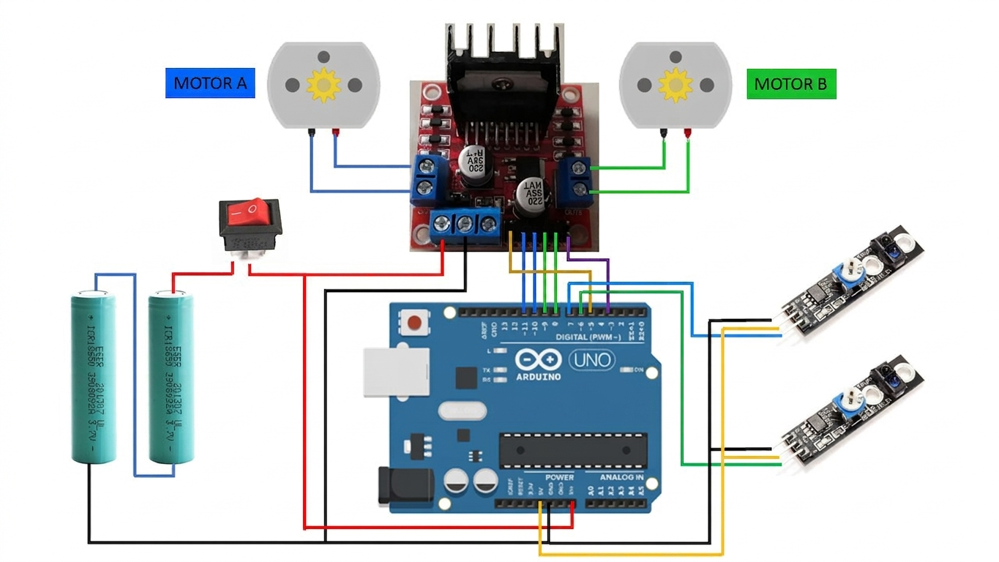

# Line Following Robot

An autonomous Line Following Robot developed using Arduino and IR sensors to detect and follow a predefined path in real time.

This project was recognized as a **winning project in an IoT Competition organized by the Education Department**, demonstrating practical application of embedded systems, robotics, and IoT concepts.

---

## Project Overview

The Line Following Robot uses infrared sensors to detect a line on the ground and continuously adjusts motor movement to remain on the path. The system processes sensor inputs in real time and controls the motors through a motor driver module.

---

## Features

- Autonomous line tracking
- Real-time path correction
- IR sensor-based line detection
- Arduino-based control system
- DC motor speed and direction control
- Embedded systems and IoT integration

---

## Technologies Used

- Arduino
- C++
- IR Sensors
- DC Motors
- Motor Driver
- Embedded Systems
- IoT Concepts

---

## Circuit Diagram

The circuit diagram can be viewed below:




---

## Demonstration Video

Watch the robot in action:

[▶ Demo Video](Demo/Demo_Video.mp4)


---

## ⚙️ System Components

- Arduino Uno
- IR Sensor Array
- L298N Motor Driver
- DC Motors
- Chassis
- Wheels
- Battery Pack

---

## How It Works

1. IR sensors continuously detect the line position.
2. Sensor data is processed by the Arduino microcontroller.
3. The controller determines whether the robot should move left, right, or forward.
4. Motor speeds are adjusted accordingly.
5. The robot remains aligned with the path autonomously.

---

## Repository Structure

```text
Line-following-Robot/
│
├── Line_following_Robot.ino
├── Circuit_Diagram.jpg
├── Demo/
    ├── Demo_Video.mp4
└── README.md
```

---

## Achievement

This project was awarded as a **Winning Project in an IoT Competition conducted by the Education Department**, showcasing innovation in robotics, automation, and embedded system design.

---

## Skills Demonstrated

- Embedded Systems Development
- Arduino Programming
- Robotics
- IoT Prototyping
- Sensor Integration
- Hardware–Software Integration
- Problem Solving
- Real-Time Control Systems

---

## Author

**Sriarani Surenther**

- GitHub: https://github.com/sriarani16
- LinkedIn: https://www.linkedin.com/in/sriarani-surenther
